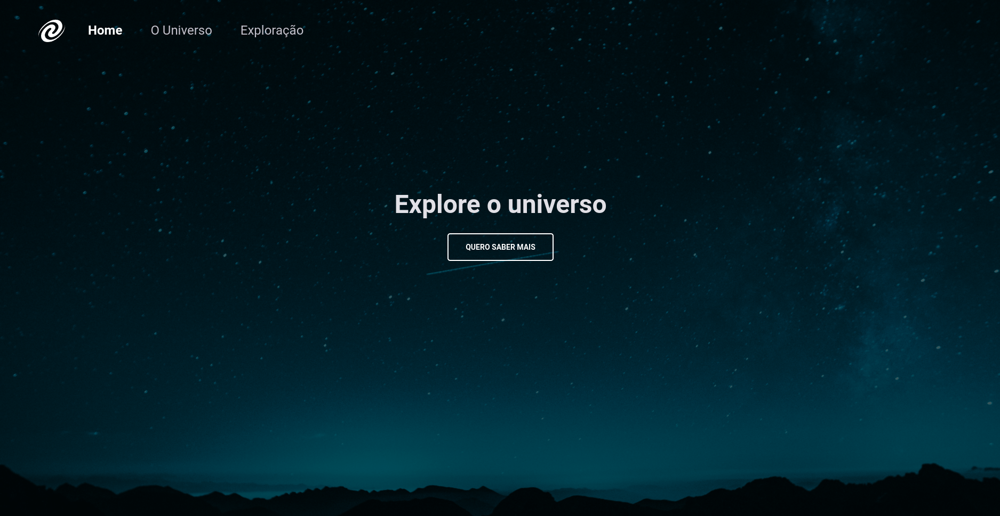

# SPA Universe

> Explorer - Stage 6

Conceitos de SPA (Single Page Aplication) na prática.  

Projeto construído no curso Explorer da Rocketseat Stage 6.

## 🛠 Tecnologias 

- HTML
- CSS
- JS
- Git e Github

## 💛 Contato

andreliciosantos@gmail.com  
[Linkedin](www.linkedin.com/in/andreliciosantos)  
[Instagram](https://www.instagram.com/andreliciosantos/)